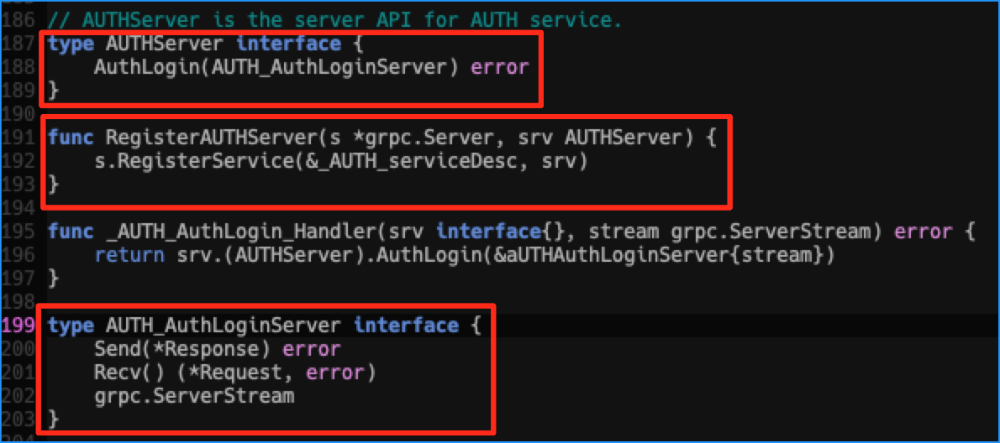
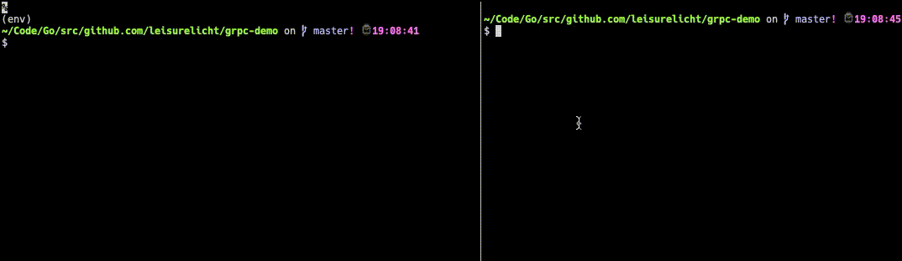

# gRPC-demo

gRPC是Google开源的一个跨语言和平台的高性能RPC框架。

*他的主要特性有：*
* 使用基于HTTP/2的传输协议。带来诸如双向流、流控、头部压缩、单TCP连接上的多复用请求等特性。
* 使用基于ProtoBuf3.x的数据序列化协议。
* 可以自动生成多种语言的代码

在这个项目中，我将演示如何使用gRPC创建一个简单的服务，我会用Go作为服务端提供服务，Python3作为客户端调用服务。

在这里，客户端会向服务端发送一组账号和密码。服务端接收到账号和密码后，会将其打印出来，同时拼接后进行Base64编码，然后再返回给客户端。

下面我们就正式开始。

## 1. 定义数据格式

首先我们使用protobuf定义传输的数据格式.这里我们需要创建`protobuf/auth.proto`文件，并在里面定义我们要传输和返回的数据格式，以及可以被远程调用的函数。代码看[这里](./protobuf/auth.proto)。

## 2. 自动生成代码

定义好数据格式以后，我们要使用protoc自动生成客户端和服务端代码。这里你需要先安装[protoc](https://github.com/protocolbuffers/protobuf#protocol-compiler-installation)。

1. 首先生成Python3需要使用的代码。

    ```
    pip3 install -r requirements.txt
    python3 -m grpc_tools.protoc -I protobuf/ --python_out=./protobuf --grpc_python_out=./protobuf protobuf/auth.proto
    ```

    这条命令会自动在`protobuf`文件夹中生成文件 `auth_pb2.py` 和 `auth_pb2_grpc.py`。

2. 生成Go需要使用的服务端代码

    ```
    protoc -I protobuf/ --go_out=plugins=grpc:protobuf/ protobuf/auth.proto
    ```
    这条命令会自动在`protobuf`文件夹中生成文件 `auth.pb.go`。

这三个文件我们将在后面编码中使用。

## 3. 编写服务端和客户端代码
    
Go服务端代码请看看[server.go](./server.go)文件。

* 在`server.go`文件中主要用到了`auth.pb.go`文件中的三个接口，如下图：


Python客户端代码请看[client.py](./client.py)文件。

* 在这里我稍微修改了一下`auth_pb2_grpc.py`文件，以解决导入出错的问题，如下图：


## 4. 运行服务

启动Server：

    go run server.go

启动client：

    python3 client.py



可以看到server收到账号密码，拼接在一起后对其进行Base64编码，然后返回给了客户端。
